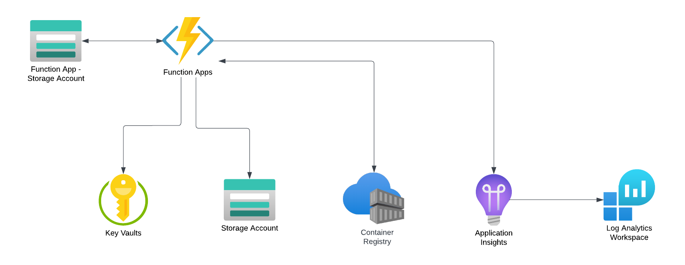
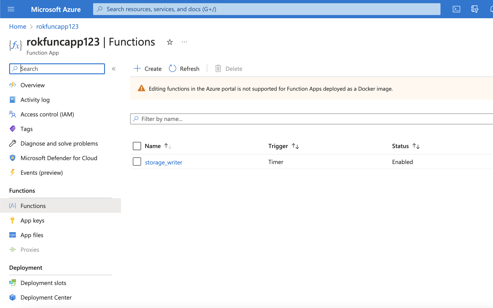
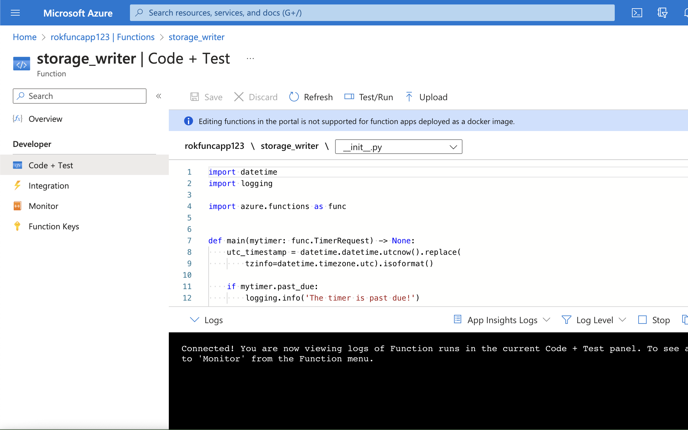
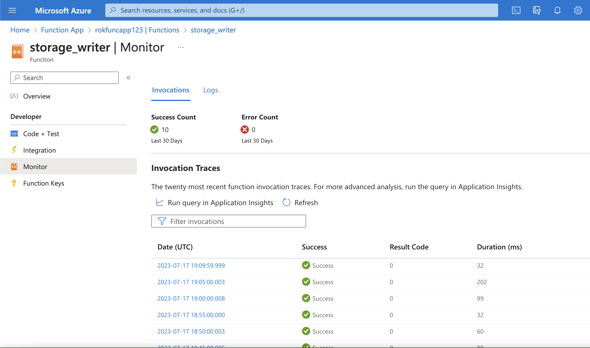
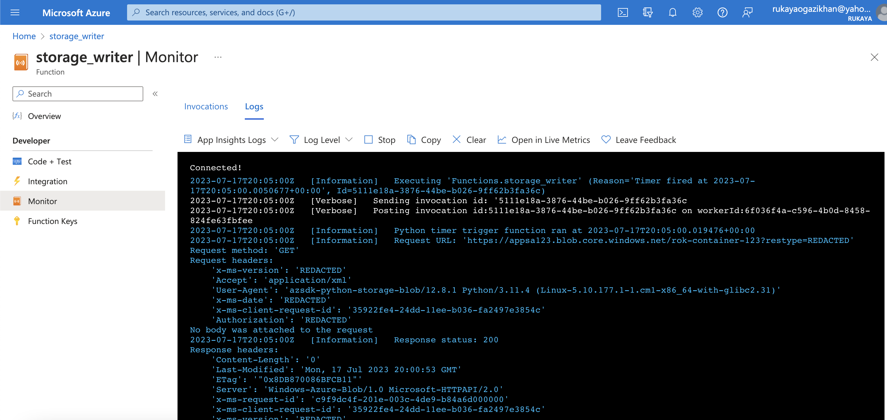

# Dockerised Azure Function App 

- [Dockerised Azure Function App](#dockerised-azure-function-app)
  - [Context](#context)
  - [Architecture](#architecture)
  - [Bootstrap Terraform](#bootstrap-terraform)
  - [Deploy Terraform (Local)](#deploy-terraform-local)
  - [Bootstrap Function App](#bootstrap-function-app)
  - [Deploy Function App (Local)](#deploy-function-app-local)
  - [Boostrap GitHub Actions](#boostrap-github-actions)
  - [Deploy Terraform (GitHub Actions)](#deploy-terraform-github-actions)
  - [Deploy Function App (GitHub Actions)](#deploy-function-app-github-actions)
  - [Useful](#useful)
    - [View Application Logs](#view-application-logs)
    - [Adding new Application Variables and Secrets](#adding-new-application-variables-and-secrets)
    - [Using a Different Function App Trigger](#using-a-different-function-app-trigger)
  - [Troubleshooting](#troubleshooting)

## Context
A dockerised Azure Function App that is triggered by a timer. This function writes to an Azure Storage Account every 2 minutes.
The application image is stored in an Azure Container Registry. Continuous Deployment is enabled on the Function App so that each time a new version of the Function App is pushed the Azure Container Registry, the Function App is updated with the new image.

## Architecture



__1. Storage Accounts__
  - The Function App Storage Account is used to support your function app as per: https://learn.microsoft.com/en-us/azure/azure-functions/storage-considerations?tabs=azure-cli
  - The Storage Account is used by the application logic itself which writes data to a Container in the Storage Account every 2 minutes

__2. Key Vault__
  - Stores the secrets needed for the Function App to run. In our case it stores the Storage Account Connection String and the name of the Storage Account Container.
  - The identity running the terraform is added to the Key Vault Access Policy so that it can write the secrets.
  - The Function Apps System Identity is added the Key Vault access policy so that it can pull the secrets.

__3. Azure Container Registry__
- Stores the Container Image 
- Webhook configuration notifies the Function App when a specified image is updated
- The Function Apps System Identity is given RBAC _AcrPull_ over the Azure Container Registry so that it can pull the application image

__4. Application Insights & Log Analytics Workspace__
- Application Insights is configured on the Function App and writes logs to the Log Analytics Workspace

__5. Function App__
- System Identity is enabled on the Function App so that it has access to the Key Vault and Azure Container Registry (as per the above).
-  Continuous Deployment is enabled on the Function App. This allows it to pull a specified image from the Azure Container Registry.


## Bootstrap Terraform 
Create an Azure Storage Account to store your Terraform State files. These actions should be run locally.

1. Set the Terraform Bootstrap Environment Variables

    (a) Copy the env.sh file to env.local.sh

    (b) Fill out the following environment variables
    example:
    ```bash
    # Path 
    export TERRAFORM_PATH=terraform

    # Terraform Backend Bootstrap and Init 
    export TERRAFORM_BACKEND_TENANT_ID="00000000-0000-0000-0000-000000000000"
    export TERRAFORM_BACKEND_SUBSCRIPTION_ID="00000000-0000-0000-0000-000000000000"
    export TERRAFORM_BACKEND_LOCATION="uksouth"
    export TERRAFORM_BACKEND_RESOURCE_GROUP="test-rg"
    export TERRAFORM_BACKEND_STORAGE_ACCOUNT="testsa"
    export TERRAFORM_BACKEND_STORAGE_ACCOUNT_SKU="Standard_LRS"
    export TERRAFORM_BACKEND_CONTAINER="teststatefiles"
    export TERRAFORM_BACKEND_STATE_FILE="test-state"
    export TERRAFORM_SERVICE_PRINCIPAL="test-terra-sp"
    ```
    (c) Set the environment variables in your terminal 
    ```bash
    source env.local.sh
    ```

2. Bootstrap Terraform 
    ```bash
    make terra-bootstrap
    ```
    > Note: Log into Azure when prompted 
    > Note: Make a note of the output of this script after: "For env.local.sh..."


## Deploy Terraform (Local)
This will deploy the Infrastructure to your Azure account from your local machine.

1. Following the 'Bootstrap Terraform' steps above

2. Set the Terraform Environment Variables
    (a) Update the env.local.sh file
    The script above outputs your terraform. Add this into your env.local.sh file. And update the ARM_SUBSCRIPTION_ID with the ID of Subscription you want to deploy your resources into.
    example:
    ```bash
    export ARM_CLIENT_ID="00000000-0000-0000-0000-000000000000"
    export ARM_CLIENT_SECRET="00000000-0000-0000-0000-000000000000"
    export ARM_TENANT_ID="00000000-0000-0000-0000-000000000000"
    export ARM_SUBSCRIPTION_ID="00000000-0000-0000-0000-000000000000"
    export ARM_ACCESS_KEY="00000000-0000-0000-0000-000000000000"
    ```

    (b) Set the environment variables in your terminal
    ```bash
    source env.local.sh
    ```

3. Update the Terraform Code

   (a) Update the _terraform.tfvars_ file with your values 
   > Note: To support Continuous Deployment the _image\_tag_ variable should be set the the same value as the tag you will push your application image with. I reccommend using the tag _latest_.

   (b) Comment out the Key Vault App Settings of the Function App
    In the _function\_app.tf_ file comment out any variables in the _app\_settings_ block that reference your Key Vault secrets
    example: 
    ```go
    # "STORAGE_ACCOUNT_CONNECTION_STRING" = "@Microsoft.KeyVault(VaultName=${var.key_vault_name};SecretName=${var.storage_account_connection_string_secret_name})"
    ```

    > Note: This prevents a circular dependcy on the Key Vault secret

4. Initialise Terraform 
    ```go
    make terra-init
    ```

5. Plan Terrafrom 
    ```go
    make terra-plan
    ```

6. Apply Terraform 
    ```go
    make terra-apply
    ```

7. Update the Terraform Code
    In the _function\_app.tf_ file uncomment any variables in the _app\_settings_ block that reference your Key Vault secrets

    example:
    ```go
    "STORAGE_ACCOUNT_CONNECTION_STRING" = "@Microsoft.KeyVault(VaultName=${var.key_vault_name};SecretName=${var.storage_account_connection_string_secret_name})"
    ```

8. Run the Terraform Workflow again 
    ```go
    make terra-init
    make terra-plan
    make terra-apply
    ```

9. To destroy your Infrastructure 
    ```go
    make terra-destroy
    ```

## Bootstrap Function App
If you are running this project you don't need to follow there steps as the code already exists in the _src_ folder. If you creating a project from scratch you should follow these steps. 

1. Follow the 'Boostrap Terraform' steps above

2. Deploy 'Deploy Terraform (local)' steps above or 'Deploy Terraform (GitHub Actions)' steps below

3. Set the following environment variables

    (a) Copy the _env.sh_ file to _env.local.sh_

    (b) Fill out the following environment variables
    example:
    ```bash
    # Path 
    export APP_PATH="src"

    # App Variable
    export APP_NAME="storage_writer"
    ```
    (c) Set the environment variables in your terminal 
    ```bash
    source env.local.sh
    ```

4. Bootstrap Application 
    ```go
    make app-bootstrap
    ```

5. Update your Python Files
   
    For this example we: 

    (a) Added the file _logic.py_ with a _write\_to\_storage_ function
   
    (b) Updated the main function in _\_\_init\_\_.py_ to call the _write\_to\_storage_ function

    (c) Update the _requirements.txt_ file to add your libraries. In our case we add the below:
    ```
    azure-storage-blob==12.8.1
    ```

## Deploy Function App (Local)
This will deploy the Function App to your Azure account from your local machine.

1. Follow the 'Bootstrap Function App' steps above 

2. Set the App Deployment Environment Variables
    (a) Update your env.local.sh file
    example:
    ```bash
    export IMAGE_TAG="latest"
    ```
    > Note: The ACR_SERVER should be the Login Server of the Azure Container Registry your created with your Terraform Deployment.

    (b) Set the environment variables in your terminal
    ```bash
    source env.local.sh
    ```

3. Deploy the application 
    ```go 
    make app-deploy
    ```

## Boostrap GitHub Actions
This will allow you to deploy your Terraform Code and Application via GitHub Actions Pipelines

1. Follow the 'Bootstrap Terraform' steps above

2. Follow the 'Bootstrap Function App' steps above

3. Create a GitHub Repository for your code 

4. Add the following Variables 
    ```bash
    TERRAFORM_PATH="terraform"
    APP_PATH="src"
    ```
    > Note: If you have a different name for the Terraform and Application code then set this accordingly 

5. Add the following Secrets
    example:
    ```bash
    ARM_CLIENT_ID="00000000-0000-0000-0000-000000000000"
    ARM_CLIENT_SECRET="00000000-0000-0000-0000-000000000000"
    ARM_TENANT_ID="00000000-0000-0000-0000-000000000000"
    ARM_SUBSCRIPTION_ID="00000000-0000-0000-0000-000000000000"
    ARM_ACCESS_KEY="00000000-0000-0000-0000-000000000000"
    TERRAFORM_BACKEND_SUBSCRIPTION_ID="00000000-0000-0000-0000-000000000000"
    TERRAFORM_BACKEND_RESOURCE_GROUP="test-rg"
    TERRAFORM_BACKEND_STORAGE_ACCOUNT="testsa"
    TERRAFORM_BACKEND_CONTAINER="teststatefiles"
    TERRAFORM_BACKEND_STATE_FILE="test-state"
    ```
    > Note: These values are output from the Bootstrap Terraform step above. Update the ARM_SUBSCRIPTION_ID with the ID of Subscription you want to deploy your resources into.

6. Run the Continuous Integration Pipeine 

    Push this code to your GitHub Repository. This will run: 
    
    (a) The _terra-ci.yml_ pipeline that will show the Terraform resources in the plan to be created

    (b) The _app-ci.yml_ pipeline that will build the Function App docker image. 

## Deploy Terraform (GitHub Actions)
This will allow you to deploy your Terraform Code via a GitHub Actions pipeline. 

1. Follow the 'Boostrap GitHub Actions' steps above

2. Update the Terraform Code

   (a) Update the _terraform.tfvars_ file with your values 
   > Note: To support Continuous Deployment the _image\_tag_ variable should be set the the same value as the tag you will push your application image with. I reccommend using the tag _latest_.

   (b) Comment out the Key Vault App Settings of the Function App
    In the _function\_app.tf_ file comment out any variables in the _app\_settings_ block that reference your Key Vault secrets
    example: 
    ```go
    # "STORAGE_ACCOUNT_CONNECTION_STRING" = "@Microsoft.KeyVault(VaultName=${var.key_vault_name};SecretName=${var.storage_account_connection_string_secret_name})"
    ```

    > Note: This prevents a circular dependcy on the Key Vault secret

3. Push your code to your source repository. This will trigger the _terra-ci.yml_ pipeline.

4. Run the pipeline _terra-cd.yml_ pipeline to deploy the Terraform Infrastructure to Azure

5. Update the Terraform Code
    In the _function\_app.tf_ file uncomment any variables in the _app\_settings_ block that reference your Key Vault secrets
    example:
    ```go
    "STORAGE_ACCOUNT_CONNECTION_STRING" = "@Microsoft.KeyVault(VaultName=${var.key_vault_name};SecretName=${var.storage_account_connection_string_secret_name})"
    ```

6. Run the pipeline _terra-cd.yml_ pipeline again to deploy the updated Terraform Infrastructure to Azure

## Deploy Function App (GitHub Actions)

1. Follow the 'Boostrap GitHub Actions' steps above

2. Follow the 'Deploy Terraform (GitHub Actions)' steps above or 'Deploy Terraform (Local)' steps above

3. Run the pipeline _app-cd.yml_ pipeline to deploy the Application

## Useful 
### View Application Logs 
1. In the Azure Portal, search for your Function App 

2. Navigate to the 'Functions' Tab and Select your Function


3. Navigate to the 'Code + Test' tab to check your Function is up to date


4. Navigate to 'Monitor' view your successful Function calls on the 'Invocations' tab


5. View you Function logs on the 'Logs' tab


### Adding new Application Variables and Secrets
1. Add the secret to the Key Vault 
    (a) update the file _key\_vault.tf_ file to add your secret/variable to the key vault 
    example: 
    ```go
    resource "azurerm_key_vault_secret" "new_var" {
    name         = var.new_var_secret_name
    value        = var.new_var_secret_value
    key_vault_id = azurerm_key_vault.main.id
    depends_on = [
        azurerm_key_vault_access_policy.current_user
    ]
    }
    ```

    (b) Update the _variables.tf_ file with the variables
    example:
    ```go
    variable "new_var_secret_name" {
    description = "New Variable"
    type        = string
    }

    variable "new_var_secret_value" {
    description = "New Variable value"
    type        = string
    }
    ```

    (c) Update the _vars.tfvars_ file with the variable values
    example:
    ```go
    new_var_secret_name = "test-secret"
    new_var_secret_value = "test-secret-value"
    ```

    > Note: if the secret value is sensitive you can add this into your environment variables with the prefix _TF\_VAR\__. See: https://developer.hashicorp.com/terraform/cli/config/environment-variables

2. Update the App Settings of the Function App
(a) In the _function\_app.tf_ file update the _app\_settings_ block to reference your Key Vault secrets
    example:
    ```go
    "NEW_VAR_FOR_APP" = "@Microsoft.KeyVault(VaultName=${var.key_vault_name};SecretName=${var.new_var_secret_name})"
    ```
    > Where _NEW\_VAR\_FOR\_APP_ is the name of the environment variable your function application is expecting

3. Re-run your Terraform Worklow to apply the changes

### Using a Different Function App Trigger
To create a function app with a different trigger:

(a) List of available templates
```go
func templates list
```

(b) Update the file __bootstrap/app-init.sh__ with the Template name

## Troubleshooting
1. Function App has incorrect image name 
Error: In some cases the Function App Image will have a trailing in the Continuous Deployment configuration. 
Solution: Temporarily change the function app _image\_name_ variable, Apply the Terraform change, correct the function app _image\_name_ it, Apply the Terraform again
